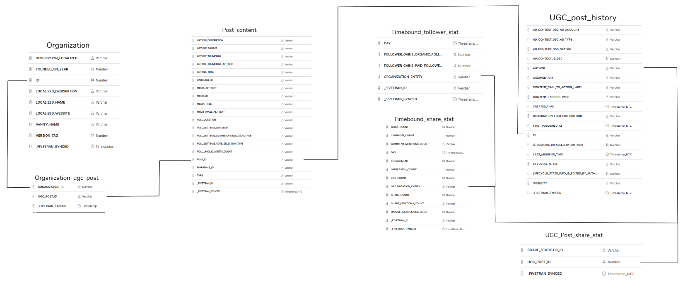

# sql_hackathon_one

Aims:
- Analyze the performance of various types of LinkedIn content.
- Understand the engagement metrics across different posts
- Enhance content personalization and scheduling to maximize user interaction

Key Metrics & Dimensions:
- Post id, title, contents, publish date
- Information Lab Page (Data School, TIL US, TIL)
- Engagement Metrics: Click Count, Comment Count, Impression Count, Like Count, Share Count

Additional Data (time_bound tables):
- Daily Follow and engagement metrics by Information Lab Pages

Output:
- 3 tables where each row is a record of measured engagement stats per day where each table shows this per organisation

Plan:
- Explore angles for what a final table(s) could consist of for data analysis based on the raw data
- Based on the raw data, investigate how the final table(s) could be constructed and what may or may not be included
- Create a schema to help understand how the tables are related and build the final table(s)

Thought Process:
- As I explored the tables and their respective data I found many fields to be either completely NULL or redundant 
e.g. If the goal is to maximise engagement it doesn't make sense to analyse posts that are private. 

- I ultimately decided to construct an end table that would provide the end user the ability to analyse how posts affect engagement
over time which could explore frequency, topics, author (branch of the company between DS UK / DS NY / TIL) and the types of engagement recorded including followers gained.

- Upon review, I decided to split the tables by organisation as this would give cleaner end results which would also offer the end user to union the tables for a company comparison if they wished

- This is the loose schema I used to help figure out how the tables possibly connect and what the context of each table was. This helped me explore
the data and what the final contents of the end tables could contain.

- In my final table I used 5/7 available tables omitting "ugc_post_share_statistics" and "organization_ugc_post" as none of their fields 
were useful for my end goal. Additionally, out of the 66 total fields available, only 15 were used to construct the final engagement analysis table 
as the rest were either empty or not useful such as vanity_name, lifetime_state etc.

Key choices for the build:
- Any field that was completely NULL was automatically disregarded, I also chose to exclude any fivetran metric as this was more important to understand
when the data was brought into snowflake rather than the data itself or the end goal of this project, however, I would consider retaining it to help with version control for future updates.

- I chose to keep null media values as this allowed engagement data for the majority of dates with 0 posts to retain engagement information which would serve as a reference point
to determine how impactful posts were

- Contrary to my initial plan I decided to keep engagement data prior to the first recorded post to serve as a baseline for how posts increased engagement relative to no posting

Final Result + Future considerations:
- The final tables produced shows the engagement recorded over time and how engagement increased when a post was published. This table offers the end user to 
analyse various factors that affect it to how to optimise future social media posts.

- The final schema shows what fields were kept and used in the final build and highlights how many of these fields were ultimately disregarded.
As so many fields were NULL or redundant finding possible angles to explore felt relatively intuitive following the brief but understanding how the tables related and the 
context of the data took some trial and error to finally nail down.

- In future I think utilising Github would have helped as I would have been able to test and explore options without having to lose the original framework built 
or having to make multiple sql files/queries. I think this would have helped me understand my thought process when reflecting on my progress to plan ahead better and also
improve efficiency in reaching the final build without having to go backwards and forwards when discovering new things about the data.