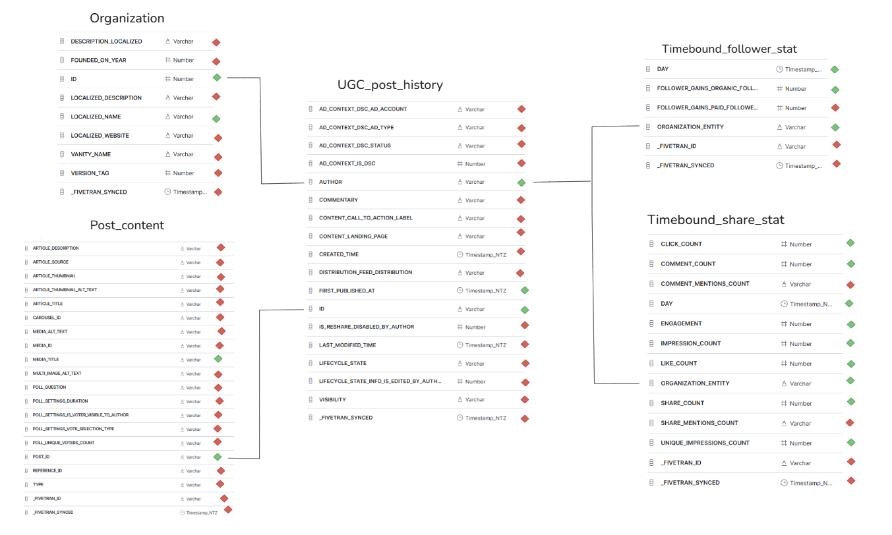

# sql_hackathon_one

Aims:
- Analyze the performance of various types of LinkedIn content.
- Understand the engagement metrics across different posts
- Enhance content personalization and scheduling to maximize user interaction

Key Metrics & Dimensions:
- Post id, title, contents, publish date
- Information Lab Page (Data School, TIL US, TIL)
- Engagement Metrics: Click Count, Comment Count, Impression Count, Like Count, Share Count

Additional Data (time_bound tables):
- Daily Follow and engagement metrics by Information Lab Pages

Output:
- A single table where each row is a record of measured engagement stats per day per post

Plan:
- Explore angles for what a final table(s) could consist of for data analysis based on the raw data
- Based on the raw data, investigate how the final table(s) could be constructed and what may or may not be included
- Create a schema to help understand how the tables are related and build the final table(s)

Thought Process:
- As I explored the tables and their respective data I found many fields to be either completely NULL or redundant 
e.g. If the goal is to maximise engagement it doesn't make sense to analyse posts that are private. 

- I ultimately decided to construct an end table that would provide the end user the ability to analyse how posts affect engagement
over time which could explore frequency, topics, author (branch of the company between DS UK / DS NY / TIL) and the types of engagement recorded including followers gained.

-I used 5/7 available tables omitting ugc_post_sHare_statistics and organization_ugc_post as none of their fields 
were useful for my end goal. Additionally, out of the 66 total fields available, only 13 were used to construct the final engagement analysis table 
as the rest were either empty or not useful such as 

Key choices for the build:
- Any field that was completely NULL was automatically disregarded, I also chose to exlucde any fivetran metric as this was important to understand
when the data was brought into snowflake rather than the data itself or the end goal of this project, however, I would consider retaining it to help with version control for future updates.

- I assumed for media_title anything NULL was related to the same post as it fell under or above, especially as it had a different media type so I chose to exclude the NULL 
values so that any engagement recorded was primaly based on the topic of the content rather than the individual media that comprises it. 

- I finally also chose to exclude engagement records before the first recorded post, this was to focus primarily on the impact posting has on the company's social media engagement.

Final Result + Future considerations:
The final table produced shows the engagement recorded over time and what post was most "active" at the time. This table offers the end user to 
analyse engagement over time and various factors that affect it to help optimise future social media posts.

In future I think utilising Github would have helped as I would have been able to test and explore options without having to lose the original framework built 
or having to make multiple sql files/queries. I think this would have helped me understand my thought process when reflecting on my progress to plan ahead better.

